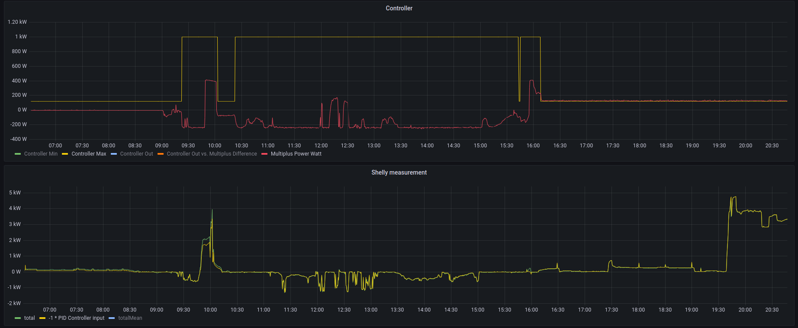

# ve-ctrl-tool (Victron Energy VE.Bus MK2 protocol tool)

this is a library and cli tools to interact with Victron (https://www.victronenergy.com/) devices
over the Mk2/3 adapter.

The author and the project are not affiliated with the Victron Company. The brand name is used
only in an educational context. Everything here is shared for educational purpose only and 
for use at your own risk.

## Usage

Interactive mode:

```shell
$ go run ./cmd/ve-shell
Mk2> read-ram 1
value=14 value=0b1110 value=0xe
Mk2> (exit with EOF / CTRL-D)
```

Commandline invocation:

```shell
$ go run ./cmd/ve-shell read-ram 1
value=14 value=0b1110 value=0xe
```

Run the `help` command to get a list of commands.

## Run with Shelly 3em

```shell
go run ./cmd/ve-ess-shelly http://10.1....shelly-address
```

Monitoring:

```shell
$ watch -n 0.1 bash -c '"curl -s localhost:18001/metrics | grep -v -E '^#' | sort"'
```

Screenshot of monitoring of a 12V Multiplus (smallest available model):



## NixOS flake

Configure NixOS Module:
```nix
{
  # ...
  services.ess-shelly.enable = true;
  services.ess-shelly.shellyUrl = "http://ip-address";
}
```