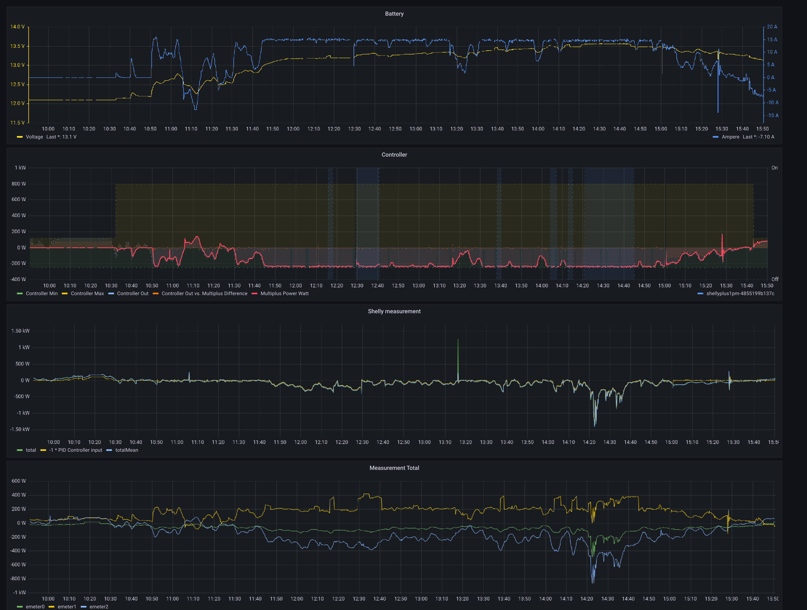

# ve-ctrl-tool (Victron Energy VE.Bus MK2 protocol tool)

this is a commandline tool to interact with Victron (https://www.victronenergy.com/) devices
over the Mk3 adapter.

## Usage

Interactive mode:

```shell
$ go run .
Mk2> read-ram 1
value=14 value=0b1110 value=0xe
Mk2> (exit with EOF / CTRL-D)
```

Commandline invocation:

```shell
$ go run . read-ram 1
value=14 value=0b1110 value=0xe
```

Run the `help` command to get a list of commands.

## Run with Shelly 3em

```shell
go run . ess-shelly http://10.1....shelly-address
```

## Monitoring

```shell
$ watch -n 0.1 bash -c '"curl -s localhost:18001/metrics | grep -v -E '^#' | sort"'
```



## NixOS flake

Running
```shell
nix run . -- -help
```

Configure NixOS Module:
```nix
{
  # ...
  services.ess-shelly.enable = true;
  services.ess-shelly.shellyUrl = "http://ip-address";
}
```